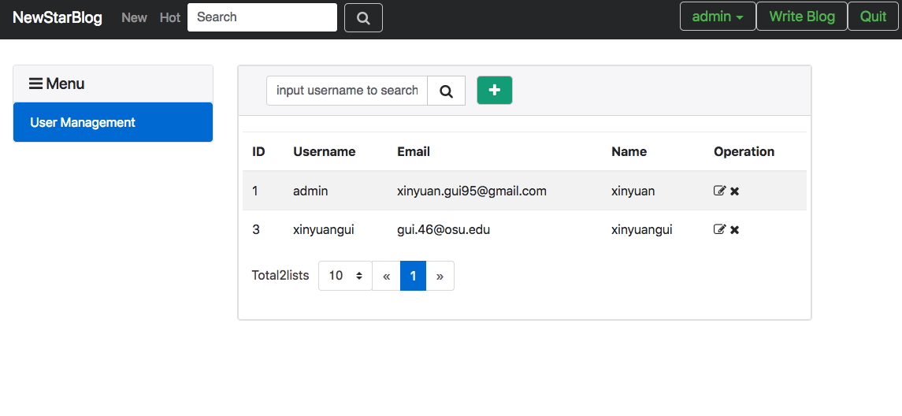

# NewStar Blog System
One blog system developed based on `Spring Boot`.[NewStar-Blog](http://newstar-blog.xinyuangui.com/)
## Installation
* Firstly you have to install [MySQL](https://www.mysql.com/), [MongoDB](https://www.mongodb.com/) and [ElasticSearch](https://www.elastic.co). Also, if you want to have one quick start, you can also check my `Embedded` branch, in which the three databases are all embedded.
* Firstly open the `MySQL`, `MongoDB` and `ElasticSearch`.
* Go to the `file-server` folder and run it firstly with `gradlew bootRun`. It will serve as one file-server for the blog-system to store the image. Actually, File Server folder can be used as one independent file server, it has its own simple webUI.
* After running the file-server, go the `blog-system` folder and run `./gradlew bootRepackage` to build.
* Run the jar file and the blog-system will run.
## Usage
* "NewStar-Blog" system is one blog-system on which programmers can share points. Blogs are written in `markdown` format. Moreover, functions like "keyword search", "hot topic rank", "tag" are also supported.
## Stack Diagram

Stack  |  Technologies
--|--
Frontend  |  Bootstrap, Thymeleaf, JavaScript, CSS
Backend  |  Spring, Spring Boot, Spring MVC, Spring Data, Spring Security, Hibernate
  Database|  MySQL, MongoDB, ElasticSearch

## Detailed Design
* Authentication and Authorization: Basically use the `Spring Security` to handle. There are two roles: `Manager` and `Blogger`. And `manager` can manage the users.
  
* Common blogs and user informations are stored in MySQL database. And user avatar and images in the blogs are firstly sent to the running file-server in different port in order to not slow down the blog-system. After the file-server storing the image, it will return one `url`.
* Blogs are firstly stored in MySQL, then it will copy one to the ElasticSearch. And ElasticSearch can have support the keyword search and hot or new rank function for all blogs in the system. However, the search for the blogs only of one user, is handled by MySQL.
